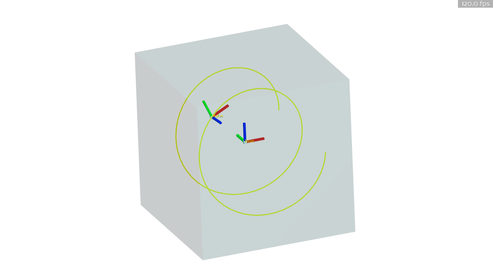

# medrob-lab4

## Setup

Configure the project with CMake:
```powershell
$env:CMAKE_TOOLCHAIN_FILE="C:\Users\FRBGuest\Desktop\Lab4\vcpkg\scripts\buildsystems\vcpkg.cmake"
cmake -B build -S .
```

Build the project:
```
cmake --build build --config Release
```

To start the program:
```powershell
python main.py --mode <MODE>
```
Select mode from `["spring", "sphere", "cube", "viscosity", "friction", "line", "curve", "extra"]`

## Example Visualization

### Spring
Implement code so that the stylus is attracted to the base like a spring.


### Sphere
Implement code so that the stylus cannot **penetrate** a sphere centered at base.


### Cube
Implement code so that the stylus cannot **escape** a cube centered at base.


### Viscosity
Implement code so that the stylus feels resistance within a cube centered at base.


### Friction
Implement code so that the stylus feels an increasing order of friction from left to right on a plane centered at base. The plane should only be able to support a defined maximum normal force before vertical penetration.


### Line
Implement code so that the stylus fixes to a straight line in the workspace.


### Curve
Implement code so that the stylus fixes to a circular curve within a cube centered at base. The stylus should move freely outside of cube.


## Troubleshooting

```
RuntimeError: [Touch] hdInitDevice failed code=770
```
Check that the Touch device is connected to the computer.
